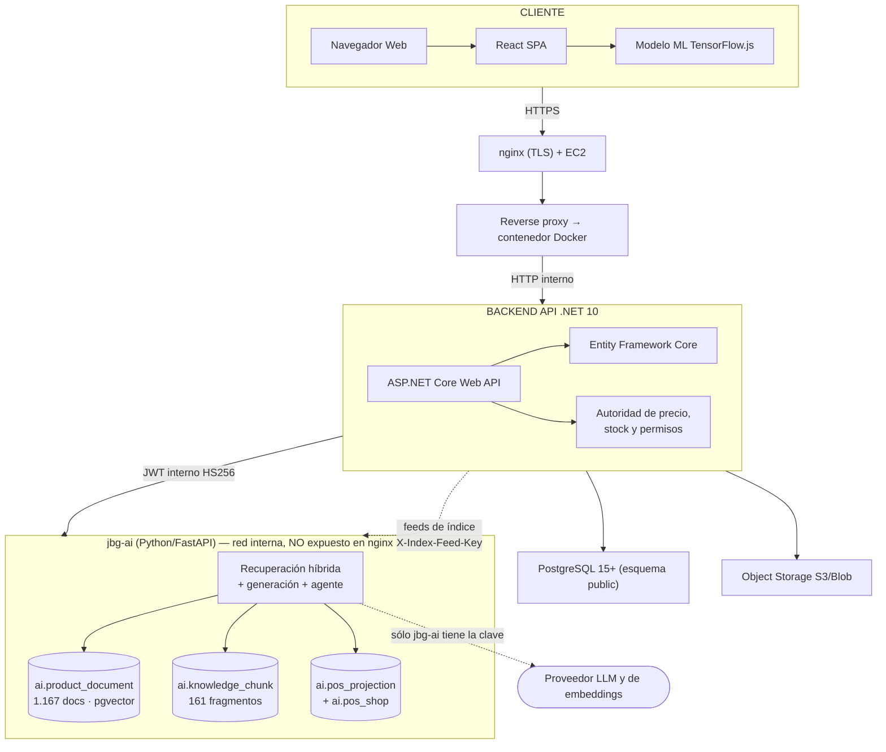
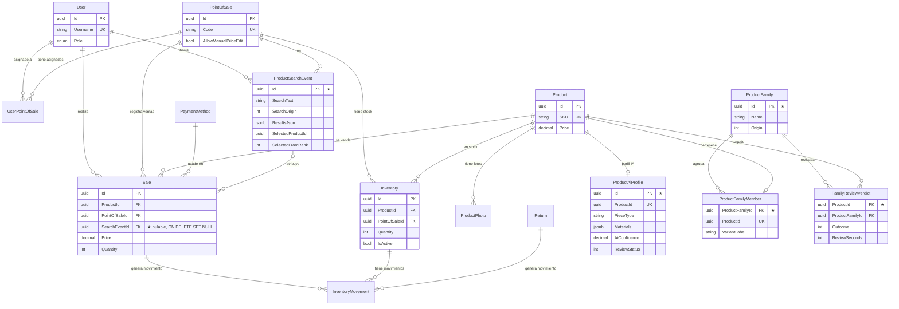
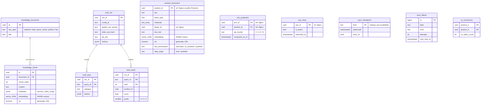
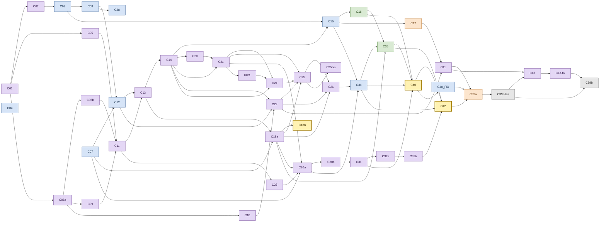

# Joiabagur PV — Asistente de venta con RAG y agente

## Índice

0. [Ficha del proyecto](#0-ficha-del-proyecto)
1. [Descripción general del producto](#1-descripción-general-del-producto)
2. [Arquitectura del sistema](#2-arquitectura-del-sistema)
3. [Modelo de datos](#3-modelo-de-datos)
4. [Especificación de la API](#4-especificación-de-la-api)
5. [Metodología: OpenSpec y Documentos](#5-metodología-openspec-y-documentos)
6. [Documentación adicional](#documentación-adicional)

---

## 0. Ficha del proyecto

### 0.1. Tu nombre completo

Sergio Valdueza Lozano

### 0.2. Nombre del proyecto

Joiabagur PV — Asistente de venta con RAG y agente para una joyería con varios puntos de venta.

### 0.3. Descripción breve del proyecto

Capa de IA generativa construida sobre un sistema de gestión de puntos de venta de joyería que ya existía. Añade búsqueda híbrida (semántica y de texto) sobre el catálogo real, una ficha de venta con argumentario redactado por un LLM y fuentes citadas, sustitutos cuando la pieza no está, y un agente de venta conversacional. Todo se evalúa con métricas y se despliega en AWS.

### 0.4. URL del proyecto

**https://52-49-209-14.sslip.io** — entorno de demostración. Las cuentas de acceso están en [1.4.2](#142-cuentas-de-la-demo).

### 0.5. URL o archivo comprimido del repositorio

https://github.com/SValduezaL/joiabagur-pv — rama de entrega `finalproject-SVL` (por defecto), rama de desarrollo `ai-eng` y rama desplegada `demo`.

El desarrollo, con sus pull requests, se hizo en [`skydr4g0n-it/joiabagur-pv`](https://github.com/skydr4g0n-it/joiabagur-pv). Este repositorio conserva todo el historial de commits, y el contenido de las 54 PR está en el [historial de pull requests](Documentos/historial-pull-requests.md).

---

## 1. Descripción general del producto

### 1.1. Objetivo

El proyecto construye un **sistema RAG y un agente de venta** sobre el catálogo real de la joyería. Su objetivo es que quien atiende en el mostrador pueda hacer tres cosas:

- **encontrar la pieza** describiéndola con sus palabras;
- **argumentar la venta** con afirmaciones que citan su fuente;
- **ofrecer alternativas** cuando la tienda no tiene lo que se pide.

El sistema se apoya en dos índices vectoriales: el catálogo de productos y el corpus comercial de la casa. El backend conserva siempre la autoridad sobre precio, stock y permisos: la IA propone y .NET pone la verdad.

**Qué es del Proyecto Final y qué ya existía:**

| Ya existía (MVP previo, fuera del alcance del PFM) | Aportado en el Proyecto Final |
|---|---|
| Catálogo, inventario por punto de venta, ventas, devoluciones, métodos de pago, usuarios y roles, reconocimiento de imagen con TensorFlow.js, escaneo de código de barras/QR, dashboards e informes | Servicio de IA `jbg-ai` (Python), búsqueda híbrida, corpus de conocimiento, venta asistida con citas, salvaguardas, sustitutos, agente de venta, enriquecimiento y familias de producto, evaluación, entorno de demostración en AWS |

### 1.2. Características y funcionalidades principales

Todas las funcionalidades de esta sección son del Proyecto Final.

#### 1. Datos de prueba realistas
- **436 productos reales** del catálogo, con sus textos completados (llegaban con descripciones casi vacías).
- **Catálogo sintético generado con LLM hasta llegar a 1.200 productos.** Se amplió por tres motivos:
  - **Volumen:** el índice vectorial y la evaluación necesitan un catálogo lo bastante grande para que buscar tenga sentido. Con el catálogo entero dentro del contexto (CAG) no se puede.
  - **Casos difíciles a propósito:** variantes que solo se distinguen por la talla, para que haya familias que agrupar; alrededor de un 20 % de descripciones escuetas y un 10 % sin descripción; y colecciones nuevas para las tiendas de hotel y aeropuerto.
  - **Métricas honestas:** cada producto lleva su origen (`real` / `synthetic`), las métricas se desglosan por origen y el golden set se ancla en los productos reales, para que un sintético «demasiado fácil» no infle los resultados.
- Un **simulador de 12 tiendas** genera inventario y ventas, con surtidos deliberadamente distintos. Sin él, la búsqueda acotada por tienda, los agotados y los sustitutos no tendrían nada que demostrar.

#### 2. Calidad del catálogo para la IA
- **Enriquecimiento con LLM**: extrae atributos estructurados de cada producto (tipo de pieza, piedra, materiales, estilo…).
- **Revisión humana de perfiles**, con tasa de corrección (20,9 %) y tiempo medio de revisión (32,1 s).
- **Familias de variantes**: un algoritmo determinista propone agrupar las variantes (486 productos pasan a 156 familias) y una persona las aprueba.
- La revisión de familias incluye los **huérfanos**: productos que se parecen a una familia sin pertenecer a ella.

#### 3. Búsqueda híbrida sobre el catálogo (RAG de productos)
- Combina la **búsqueda semántica** (embeddings y pgvector) con la **búsqueda de texto en español** de PostgreSQL. Las dos listas se fusionan por *Reciprocal Rank Fusion* en dos etapas.
- Un **diccionario de sinónimos del oficio** amplía la consulta: «gargantilla» encuentra collares y «sortija» encuentra anillos. También tolera la falta de eñe y los plurales.
- Se **acota al surtido de la tienda**: lo agotado baja en la lista pero no desaparece.
- **Se abstiene** cuando el catálogo no puede responder, en lugar de devolver cinco piezas al azar.
- Si la IA falla, degrada a un buscador léxico sobre la misma tienda y lo indica.
- **Cifra:** nDCG@5 de **0,092** (el buscador que tenía la joyería) a **0,740** sobre el mismo golden set de 72 consultas.

#### 4. Venta asistida con fuentes citadas (RAG de conocimiento)
- Un **corpus comercial** de 32 documentos Markdown, troceado en 161 fragmentos. Cada fragmento es citable por `documento#sección`.
- **Ficha de venta** de una pieza: sus variantes agrupadas, los avisos relevantes (otras tallas, etiqueta ausente), las citas y un **argumentario redactado por un LLM**.
- **Verificación determinista, sin un segundo LLM de juez:**
  - cada cita debe existir entre las fuentes entregadas;
  - cada cita debe tener la frase que la apoya;
  - no puede aparecer ninguna cifra que no esté en los datos.
- Precio y stock viajan como huecos que **rellena .NET** con los datos de esa tienda.
- Se puede escribir la pregunta del cliente («¿se puede mojar?») y la respuesta llega citada.
- **Cifra:** 118 de 120 argumentarios generados no escriben ni un dígito.

#### 5. Consulta libre, salvaguardas y enrutado de intención
- Se puede preguntar **sin tener una pieza delante** («algo para regalar a mi madre, no muy llamativo»). La respuesta llega agrupada por familia y explicada en prosa.
- Un **clasificador de intención** decide antes de buscar. Distingue «esto no es de joyería» de «es joyería, pero este catálogo no lo tiene».
- Si la consulta es ambigua, **repregunta** con un mensaje elegido de un catálogo cerrado, no inventado por el modelo.
- Si el clasificador no está disponible, el sistema se comporta como si no existiera (*fail-open*).
- **Cifra:** no silencia ninguna de las 48 consultas contestables, con un 0 % de falsos positivos sobre 119 casos.

#### 6. Sustitutos
- Cuando la pieza no está, propone **alternativas del mismo tipo de pieza** ordenadas por parecido real.
- Pone delante la talla pedida y muestra lo agotado al final, sin esconderlo.
- Cada alternativa explica por qué aparece.

#### 7. Agente de venta
- Un bucle de *function calling* sobre **seis herramientas de solo lectura**: buscar en el catálogo, proponer sustitutos, listar la familia, consultar el corpus, consultar la disponibilidad y pedir aclaración.
- Tiene **presupuestos duros**: vueltas, llamadas, tokens y tiempo.
- **Cambia de plan** si la pieza pedida está agotada y pasa a ofrecer sustitutos.
- Muestra la **traza** de lo que ha consultado y rotula de dónde sale cada pieza (catálogo o sustitutos).
- Cuando se detiene, **explica el motivo en castellano**. Hay diez motivos cerrados y ninguno se muestra como una avería.
- **Cifra:** 17 de 20 escenarios de calibración cumplen su expectativa.

#### 8. Evaluación medible
- **Golden set versionado**: consultas juzgadas a mano con una escala de tres grados y un criterio escrito antes de etiquetar.
- **Arnés de líneas base**: CAG (el catálogo entero en contexto), búsqueda léxica, vectorial e híbrida.
- **Procedencia en cada corrida**: dos corridas de procedencia distinta se declaran no comparables.
- Taxonomía completa de métodos con su cifra: [informe de cierre §4](Documentos/Proyecto%20Final%20AIEng/informes/c39b-implementation-measurements.md).

#### 9. Operación
- La copia del surtido por tienda que usa el buscador se **refresca sola** al arrancar y cada 10 minutos.
- La **tarjeta de salud del servicio de IA** en el panel de administración muestra la BD, el índice, el proveedor, la discrepancia de modelo de embeddings y las tiendas sin surtido sincronizado.
- La **demo se despliega en AWS** con Terraform y se verifica automáticamente desde dentro del anfitrión.

### 1.3. Diseño y experiencia de usuario

Al iniciar sesión se llega al dashboard. Las funcionalidades de IA **no tienen entrada propia en el menú lateral**: están en la página **Ventas**, como vías de entrada a una venta, junto al registro manual y al escaneo.

| Funcionalidad | Cómo se accede | Rol |
|---|---|---|
| Búsqueda rápida y respuesta asistida | Ventas → tarjeta **«Buscar con ayuda»** → `/sales/new/assisted`. Un selector elige la vía (rápida, 30/min, o asistida, 10/min). Antes de buscar, el panel muestra qué vías están activas | Administrador y operador |
| Agente de venta | Ventas → tarjeta **«Preguntar al agente»** → `/sales/new/agent`. Si el agente está apagado, la tarjeta sale deshabilitada y explica el motivo | Administrador y operador |
| Ficha de venta (argumentario, citas, pregunta, tallas y sustitutos) | Botón **«Ver ficha de venta»** en cada resultado de la búsqueda con ayuda, del agente, de la venta manual o del escaneo → `/sales/new/assist/:productId`. Desde la ficha, «Vender» lleva a la caja | Administrador y operador |
| Atribución de la venta a la búsqueda | Automática: al vender desde un resultado, la venta queda ligada a la búsqueda que la originó | Administrador y operador |
| Revisión de familias y huérfanos | Menú **Configuración → Revisión de familias** (`/admin/family-review`) | Administrador |
| Revisión de perfiles de IA y sus métricas | Menú **Configuración → Revisión de perfiles** (`/admin/profile-review`) | Administrador |
| Salud del servicio de IA y surtido por tienda | **Dashboard** → tarjeta **«Servicio de IA»** | Administrador |

**Sin pantalla: solo por API o línea de comandos**

| Funcionalidad | Cómo se ejecuta |
|---|---|
| Enriquecimiento de perfiles en lote | `POST /api/ai/catalog/enrich-batch` (administrador) |
| Propuesta y aplicación de familias | `POST /api/ai/catalog/family-suggestions` y `.../family-suggestions/apply` (administrador) |
| Indexación del catálogo, del surtido, de las tiendas y del corpus | `python -m jbg_ai.indexing sync \| sync-pos \| sync-pos-shops \| sync-knowledge` |
| Catálogo sintético y mundo simulado | `python -m jbg_ai.data generate \| ingest` y `python -m jbg_ai.data world simulate \| ingest` |
| Ingesta del catálogo real (pipeline offline) | `uv run catalog-pipeline generate \| validate \| ingest` en `scripts/catalog/` |
| Evaluación | `uv run evals run \| sweep \| rescore \| cag`, `python -m jbg_ai.evals.agent_sweep`, `python -m jbg_ai.evals.routing_run` |

La interfaz está pensada para usarse en el móvil en el punto de venta y es *responsive* para la administración. La moneda es el euro, con formato español.

### 1.4. Instrucciones de instalación

#### 1.4.1. Entorno de demostración en AWS (Terraform)

> **La demo publicada se despliega todavía desde [`skydr4g0n-it/joiabagur-pv`](https://github.com/skydr4g0n-it/joiabagur-pv)**: su rol OIDC y la URL de su paquete de despliegue apuntan a ese repositorio, y en este el flujo `deploy-demo.yml` está desactivado. Para trasladarla, aplica Terraform **solo** sobre el rol de despliegue y el parámetro `DEPLOYMENT_BUNDLE_URL` (`-target`). Un `apply` completo cambiaría el `user_data` y **reemplazaría la EC2**, borrando la base de la demo. Ver el [runbook](deploy/demo/README.md), §2.

La demo vive en una **cuenta AWS dedicada** (`eu-west-1`), con su propio estado de Terraform en [terraform/demo/](terraform/demo/). El procedimiento completo está en el [runbook](deploy/demo/README.md).

**Qué crea `terraform apply`:**

| Recurso | Detalle |
|---|---|
| EC2 `jbg-demo-host` | `t3.small`, Amazon Linux 2023, gp3 de 30 GiB cifrado, IMDSv2 obligatorio |
| IP elástica | Da el dominio: `<ip-con-guiones>.sslip.io`, con TLS automático de Let's Encrypt vía Caddy |
| Security group | Solo entradas por **80 y 443**. No se abren ni la API, ni la BD, ni el servicio de IA |
| ECR | `jbg-demo-api` y `jbg-demo-ai`, conservando las 5 últimas imágenes |
| IAM | Proveedor OIDC de GitHub y rol de despliegue limitado a la rama/entorno `demo`; rol de instancia con SSM y lectura de `/jbg-demo/*` |
| SSM Parameter Store | `DEMO_HOSTNAME`, `ECR_REGISTRY`, `DEPLOYMENT_BUNDLE_URL` e `IMAGE_TAG` (no secretos) |
| Estado | Bucket S3 `jbg-demo-terraform-state`, creado a mano antes del `init` |

**Pasos:**

1. **Cuenta y acceso.** Crea la cuenta AWS dedicada, el perfil SSO y el bucket de estado ([runbook §1](deploy/demo/README.md)).
2. **Infraestructura.**
   ```bash
   cd terraform/demo
   cp terraform.tfvars.example terraform.tfvars   # única variable obligatoria: github_repo
   terraform init && terraform plan && terraform apply
   terraform output                               # rol de despliegue, instancia, IP y URL
   ```
3. **Secretos**, creados a mano como `SecureString` para que nunca pasen por el estado de Terraform:
   - obligatorios: `/jbg-demo/POSTGRES_PASSWORD`, `AI_DB_PASSWORD`, `JWT_SIGNING_KEY`, `AI_SERVICE_SHARED_SECRET`, `INDEX_FEED_SHARED_KEY` y `EMBEDDING_API_KEY`;
   - opcionales, uno por etapa generativa: `ASSIST_LLM_API_KEY`, `ROUTER_LLM_API_KEY` y `AGENT_LLM_API_KEY`. Si falta alguno, esa etapa se degrada de forma declarada.
4. **GitHub.** Crea la rama `demo` y el *Environment* `demo` con el secreto `DEMO_DEPLOY_ROLE_ARN`. Luego lanza `gh workflow run deploy-demo.yml`. El workflow construye las dos imágenes, las sube a ECR y despliega por SSM, sin claves AWS de larga duración.
5. **Primer despliegue.** Falla **a propósito** en `alembic upgrade head`, porque el rol `jbg_ai` y el esquema `ai` aún no existen. Ejecuta una vez `ai-service/migrations/bootstrap.sql` en el anfitrión (por SSM) y relanza el workflow.
6. **Datos.** Restaura un `pg_dump` de los esquemas `public` y `ai`, sustituyendo el personal real por las cuentas de la demo ([runbook §5](deploy/demo/README.md)). La copia del surtido se drena sola al arrancar.
7. **Verificación automática.** `verify.sh` se ejecuta dentro del anfitrión y **hace fallar el despliegue** si se da cualquiera de estas condiciones:
   - el índice está vacío;
   - el modelo de embeddings configurado no coincide con el del índice;
   - la base de datos no responde;
   - falta la credencial del proveedor;
   - hay una tienda activa sin surtido;
   - el corpus de conocimiento está vacío;
   - la ruta del agente no responde.
8. **Desmontaje:** `terraform destroy`.

**Contenedores en el anfitrión** ([compose.demo.yaml](compose.demo.yaml)). **Solo el proxy publica puertos**:

```text
Internet ─443─▶ jbg-demo-proxy (Caddy, TLS) ─▶ jbg-demo-api (.NET + SPA)
                                                 ├─▶ jbg-demo-postgres (PostgreSQL 15 + pgvector)
                                                 └─▶ jbg-demo-ai (FastAPI, sin puertos publicados) ─▶ proveedor LLM
```

#### 1.4.2. Cuentas de la demo

Hay tres operadores, cada uno asignado a una tienda con un surtido **deliberadamente distinto**. Algunos comportamientos solo se pueden observar desde una de ellas.

| Usuario | Contraseña | Rol / tienda | Qué permite probar |
|---|---|---|---|
| `demo.admin` | `DemoAdmin123!` | Administrador | Tarjeta de salud del servicio de IA, revisión de familias y revisión de perfiles |
| `op-ciutadella` | `Operator123!` | Operador · CIU-CENTRE | **El camino feliz**: es el surtido más amplio, así que el argumentario se genera. Conviene empezar aquí |
| `op-fornells` | `Operator123!` | Operador · FORNELLS | **Abstención, sustitutos y aviso de agotado**: es el surtido más pequeño y con más piezas a cero |
| `op-aeroport` | `Operator123!` | Operador · MAO-AIR | **El agente cambiando de plan hacia sustitutos**. Hay que nombrar la pieza por su referencia (p. ej. `SKU1127`): si se nombra por su nombre, el agente no cambia de plan (limitación declarada) |

La cuenta `admin` / `Admin123!` del entorno local está **desactivada a propósito** en la demo: un `401` con ella es el comportamiento esperado.

**Recorrido paso a paso:** la [guía del revisor](Documentos/Proyecto%20Final%20AIEng/guia-del-revisor.md) explica, pantalla a pantalla y como administrador, cómo llegar a cada funcionalidad, qué escribir y qué debe aparecer.

#### 1.4.3. Entorno local

**Requisitos:** .NET 10 SDK, Node.js 20+, Docker, y Python 3.11 con [uv](https://docs.astral.sh/uv/) si se quiere ejecutar el servicio de IA fuera de Docker.

| Pieza | Puerto | Arranque |
|---|---|---|
| PostgreSQL + pgvector | `5433` | `docker compose up -d postgres` (en `backend/`) |
| Servicio de IA `jbg-ai` | `8001` | `docker compose up --build jbg-ai` (en `backend/`) |
| API .NET | `5056` | `dotnet run` |
| SPA React | `3000` | `npm run dev` |

```bash
# 1. Base de datos y servicio de IA (claves de proveedor en backend/.env; STUB_MODE=true responde sin llamar a nada)
cd backend && docker compose up -d postgres && docker compose up --build jbg-ai

# 2. Backend: el perfil de arranque es obligatorio (sin él, .NET asume Production y la cookie de sesión no funciona)
cd backend/src/JoiabagurPV.API
cp Properties/launchSettings.Example.json Properties/launchSettings.json
dotnet run                          # aplica las migraciones y siembra el administrador

# 3. Frontend
cd frontend && npm install --legacy-peer-deps && npm run dev
```

Usuario por defecto en local: `admin` / `Admin123!`.

**Tests.** Las tres suites se ejecutan **en serie**: en paralelo, los tests de integración del backend pierden la conexión con Docker.

- Backend: `dotnet test` en `backend/src/JoiabagurPV.Tests`.
- Frontend: `npm run test` en `frontend/`.
- Servicio de IA: `uv run pytest` en `ai-service/`. Ningún test llama al proveedor.

Hay que leer la línea de resumen, no el código de salida.

Más detalle en los README de [backend](backend/README.md), [frontend](frontend/README.md) y [ai-service](ai-service/README.md).

#### 1.4.4. Integración continua: limitaciones conocidas

Estas limitaciones **vienen del MVP y no las ha introducido el Proyecto Final**:

- **Los workflows de tests no se habían ejecutado nunca.** `test-backend.yml` y `test-frontend.yml` se crearon en enero de 2026 escuchando las ramas `main` y `develop`, que no existen en el repositorio. Durante el PFM se corrigieron los disparadores (PR a `ai-eng` y `master`) y se ejecutaron por primera vez.
- **Las dos suites de aplicación arrastran fallos preexistentes**: unos 50 en el backend y 113 en el frontend, parte de ellos inestables entre ejecuciones. Por eso la CI es informativa y no hace de puerta, y no hay protección de ramas. El inventario de causas está en [testing-backend.md](Documentos/testing-backend.md) y [testing-frontend.md](Documentos/testing-frontend.md).

Una limitación que sí es del PFM:

- **No hay workflow para la suite del servicio de IA**: `uv run pytest` se ejecuta en local.

---

## 2. Arquitectura del sistema

### 2.1. Diagrama de arquitectura

La aplicación es un monolito .NET con una SPA React, más **un único servicio separado: el de IA**. Tres principios la gobiernan:

- **Frontera de proceso única.** `jbg-ai` es un contenedor Python porque ahí vive el ecosistema de recuperación vectorial y de clientes de LLM. El navegador nunca lo llama.
- **.NET conserva la autoridad.** La IA ordena candidatos; .NET los hidrata con el precio y el stock de esa tienda y descarta lo que no lleva.
- **Degradación, no pantalla vacía.** Si la IA falla, la búsqueda cae a un buscador léxico sobre la misma tienda y lo indica.

**Los cinco pilares del proyecto:**

| Pilar | Dónde vive | Superficie de usuario |
|---|---|---|
| **CAG** — el catálogo entero en el contexto | `ai-service/evals/`, como línea base | Ninguna: existe para medir por qué hace falta RAG |
| **RAG** — dos índices vectoriales | `ai.product_document` (productos) y `ai.knowledge_chunk` (corpus comercial) | Búsqueda con ayuda, consulta libre y ficha de venta |
| **Agentes** | `ai-service/src/jbg_ai/assist/agent.py` | `/sales/new/agent` |
| **Evaluación** | `ai-service/evals/` — golden set, arnés y líneas base | Informes de medición |
| **Despliegue** | `terraform/demo/`, `compose.demo.yaml` y `deploy/demo/` | La URL pública |



**Cómo leer el diagrama:**

- **El navegador no tiene ninguna flecha hacia `jbg-ai`.** El servicio que guarda la clave del proveedor no es alcanzable desde Internet. Lo garantizan tres capas: el security group, los puertos publicados y la ausencia de ruta.
- **El esquema `ai` es exclusivo de `jbg-ai`**, que nunca lee el esquema `public`. Lo que necesita del catálogo y del inventario le llega por los *feeds* de índice de .NET.
- **Los dos índices nunca se fusionan.** Un producto se ordena y se hidrata; un fragmento de conocimiento se **cita**.
- En la demo, nginx lo sustituye **Caddy** (ver [1.4.1](#141-entorno-de-demostración-en-aws-terraform)).

### 2.2. Descripción de componentes principales

- **Backend:** ASP.NET Core Web API (.NET 10), EF Core, PostgreSQL, JWT y Serilog, con patrón Repository y capa de servicios. Incluye el **cliente de pasarela hacia `jbg-ai`**, con *timeouts*, un reintento, *circuit breaker* y límites por vía.
- **Frontend:** React 19, TypeScript, Vite, Metronic (Layout 8), Tailwind, React Hook Form + Zod. Tiene **cuatro vías de entrada a la venta** —manual, escaneo, búsqueda con ayuda y agente— y la ficha de venta.
- **Base de datos:** PostgreSQL con dos esquemas. `public` es de .NET y se migra con EF Core; `ai` es de `jbg-ai`, se migra con Alembic y usa **pgvector**.
- **Almacenamiento:** ficheros locales en desarrollo y S3 en producción.
- **Servicio de IA (`jbg-ai`):** Python 3.11, FastAPI, SQLAlchemy 2 + psycopg 3, con el pool limitado a cinco conexiones y el cliente de modelos vía LiteLLM. `ai-service/openapi.json` es un **contrato congelado** con .NET.
- **Evaluación (`ai-service/evals/`):** golden set versionado, arnés de líneas base y barridos. Los resultados se guardan en `evals/results/` con su procedencia.

### 2.3. Descripción de alto nivel del proyecto y estructura de ficheros

```text
backend/                  Solución .NET en capas: Domain, Application, Infrastructure, API y Tests
frontend/                 SPA React: src/pages por módulo, src/services (API), src/components
ai-service/               Servicio de IA jbg-ai (FastAPI)
  src/jbg_ai/api/           rutas /v1, autenticación de servicio y planificador de arranque
  src/jbg_ai/retrieval/     búsqueda híbrida, sinónimos, acotado por tienda, abstención y sustitutos
  src/jbg_ai/knowledge/     búsqueda y citas sobre el corpus comercial
  src/jbg_ai/assist/        ficha de venta, argumentario y verificación, enrutador, herramientas y agente
  src/jbg_ai/indexing/      texto canónico, embeddings y drenajes de catálogo, surtido y tiendas
  src/jbg_ai/enrichment/    extracción de atributos con LLM
  src/jbg_ai/families/      propuesta y auditoría de familias de variantes
  src/jbg_ai/data/          catálogo sintético y simulador del mundo (CLI)
  src/jbg_ai/evals/         barridos del argumentario, del enrutador y del agente
  evals/                    golden set, configuraciones y resultados de evaluación
  migrations/               Alembic del esquema ai (y bootstrap.sql)
  prompts/                  prompts versionados (enriquecimiento y asistencia)
data/catalog/             corpus JSONL del catálogo real y sintético
data/world/               receta de las 12 tiendas simuladas
data/knowledge/           corpus comercial: 32 documentos Markdown
scripts/catalog/          pipeline offline de ingesta del catálogo real
deploy/demo/              Caddyfile, deploy.sh, verify.sh y runbook de la demo
compose.demo.yaml         composición de los cuatro contenedores de la demo
terraform/                infraestructura de producción; terraform/demo/, la de la demo
openspec/                 specs vivas y changes archivados (OpenSpec)
Documentos/               arquitectura, modelo de datos, guías y memoria del Proyecto Final
```

### 2.4. Infraestructura y despliegue

- **Producción (MVP):** EC2 con nginx (TLS) y un contenedor con la API .NET y la SPA; RDS PostgreSQL, S3, ECR y SSM. Su despliegue **no forma parte de este repositorio**: sus flujos de GitHub Actions eran del MVP y se han retirado. La guía se conserva como referencia histórica en [deploy-aws-production.md](Documentos/Guias/deploy-aws-production.md).
- **Demostración (PFM):** una cuenta AWS distinta, con su estado de Terraform y su workflow (`deploy-demo.yml`, con push a `demo`). Tiene cuatro contenedores y solo el proxy expone puertos. Los secretos se leen de SSM al entorno del proceso y **nunca se escriben en disco**. La verificación se ejecuta **dentro del anfitrión** y puede tumbar el despliegue. Detalle en [1.4.1](#141-entorno-de-demostración-en-aws-terraform).

### 2.5. Seguridad

- Autenticación con JWT y *refresh tokens*; contraseñas con BCrypt.
- Control de acceso por rol (Administrador / Operador) y por punto de venta.
- CORS por origen, HTTPS y secretos en AWS SSM Parameter Store.
- EF Core frente a inyección SQL y sanitización frente a XSS.
- **Entre .NET y `jbg-ai`:** JWT interno HS256 con el punto de venta en el *claim*, así que la IA solo busca en el ámbito que .NET autoriza.
- **Feeds de índice:** una clave propia (`X-Index-Feed-Key`), porque el cliente es un proceso y no una persona.
- **Frontera por permisos, no por convención:** el rol `jbg_ai` de PostgreSQL recibe `permission denied` sobre `public`.
- **Límites de uso** por usuario y por vía (429), con cupos propios para la respuesta asistida, la ficha de venta y el agente.

### 2.6. Tests

- **Backend:** xUnit, Moq y FluentAssertions; tests de integración con Testcontainers (PostgreSQL).
- **Frontend:** Vitest, React Testing Library y MSW.
- **Servicio de IA:** pytest con el `TestClient` de FastAPI. Cubre los contratos y su snapshot OpenAPI, la recuperación, el corpus, la ficha de venta con sus verificaciones, el enrutador, las herramientas (incluido el invariante de solo lectura), el bucle del agente con sus presupuestos, los drenajes y la evaluación. **Ningún test llama a un proveedor LLM ni de embeddings**: el cliente se sustituye por un doble que falla si alguien lo llama de verdad.
- **Comprobación manual:** cada superficie se recorrió en la demo con las cuentas de [1.4.2](#142-cuentas-de-la-demo). Varios defectos solo aparecieron así, y se corrigieron.

---

## 3. Modelo de datos

La base de datos tiene **dos esquemas con dueños distintos**:

- `public`: el modelo transaccional, de .NET, migrado con EF Core.
- `ai`: la memoria del servicio de IA, de `jbg-ai`, migrado con Alembic.

Descripción completa en [Documentos/modelo-de-datos.md](Documentos/modelo-de-datos.md).

### 3.1. Esquema `public` (transaccional, .NET)

Las entidades que añadió el Proyecto Final se marcan con ★.



**Entidades del MVP (resumen):**
- **Product**: SKU único y precio.
- **PointOfSale**: código único y permiso de edición manual de precio.
- **Inventory**: único por producto y tienda. Su registro activo decide qué ve el operador.
- **Sale**: precio congelado, método de pago y foto opcional.
- **InventoryMovement**: venta, devolución, ajuste o importación, con el antes y el después.

Además: User, Return, PaymentMethod y Collection.

**Entidades del Proyecto Final:**

| Entidad | Para qué |
|---|---|
| ★ **ProductSearchEvent** | Una fila por búsqueda asistida o del agente: consulta, filtros, resultados, vía (`SearchOrigin`), tiempos y **qué producto se eligió y en qué posición**. `Sale.SearchEventId` atribuye la venta a la búsqueda |
| ★ **ProductAiProfile** | Los atributos que extrae el LLM (tipo de pieza, piedra, materiales, etiquetas), con la confianza y el origen por campo, la versión del prompt y el **estado de revisión humana** con su duración |
| ★ **ProductFamily** / **ProductFamilyMember** | Agrupa las variantes de una misma pieza. Un producto pertenece como mucho a una familia |
| ★ **FamilyReviewVerdict** | La decisión humana sobre un par producto–familia (confirmar o rechazar), con el tiempo invertido. Alimenta las métricas de la revisión |

### 3.2. Esquema `ai` (servicio de IA)

Es la memoria del servicio de IA, y la frontera con .NET **la impone un permiso, no una convención**:

- **Sin acceso a `public`:** el rol `jbg_ai` no puede leerlo. Recibe los datos por los *feeds* HTTP de .NET.
- **Sin claves ajenas hacia `public`:** `product_id`, `pos_id` y `family_id` son `uuid` sueltos, a propósito. Así, una proyección que se reconstruye no queda atada al ciclo de vida de las tablas transaccionales.
- **Migraciones propias:** Alembic, escrito a mano. Los vocabularios cerrados se definen con `CHECK`, no con `ENUM`.
- **Vectores:** `vector(1536)` (`text-embedding-3-small`) con índice **HNSW por coseno**. Las columnas `tsv` son generadas, con `to_tsvector('spanish', …)` e índice GIN.



| Tabla | Qué guarda | Quién la escribe |
|---|---|---|
| `product_document` | Un documento por producto: texto canónico, atributos, **embedding** y `tsv` en español. Es el índice de búsqueda | Drenaje del *feed* de catálogo (`indexing sync`) |
| `knowledge_document` / `knowledge_chunk` | El corpus comercial y sus fragmentos citables, cada uno con su `claim_scope` (dato general o compromiso de la casa) | `indexing sync-knowledge` |
| `pos_projection` | El surtido por tienda en **tramos** (`0`, `1-2`, `3+`), **nunca la cantidad exacta**: el número real lo pone .NET | Drenaje del surtido: al arrancar y cada 10 min |
| `pos_shop` | Qué tiendas existen y cuáles están activas. Es una foto completa, sin cursor | Drenaje de tiendas, junto al anterior |
| `sync_checkpoint` / `sync_failure` | El marcador *keyset* de cada *feed* y la cola de lotes fallidos | Los drenajes |
| `eval_run` / `eval_case` / `eval_result` | El historial de evaluación, con la **tupla de procedencia** que decide si dos corridas son comparables | Arnés `evals` |
| `co_occurrence` | Reservada para recomendaciones complementarias. **Sin uso**: esa funcionalidad se descartó por falta de señal | — |

---

## 4. Especificación de la API

### 4.1. Convenciones

- Base `/api`. Los endpoints protegidos usan la cookie o la cabecera `Authorization: Bearer <token>`.
- Los *feeds* de índice (`/api/ai/index-feed/*`) no usan token de usuario: autentican con **`X-Index-Feed-Key`**.
- Las vías de IA tienen **límites de uso propios**. Superarlos devuelve `429`, que no significa que el servicio esté caído.
- En desarrollo, la especificación OpenAPI está en `/openapi/v1.json` y la interfaz Scalar en `/scalar/v1`.

### 4.2. Endpoints de ventas (con atribución a la búsqueda)

#### POST /api/sales — Crear venta

Crea una venta validando el stock, que el método de pago esté asignado al punto de venta y que el usuario esté asignado a ese punto (o sea administrador). El inventario se actualiza en la misma transacción.

`searchEventId` es opcional y atribuye la venta a la búsqueda asistida de la que procede. Se comprueba que el evento exista **y pertenezca a quien vende**; si no, la atribución queda nula sin error. `POST /api/sales/bulk` lo acepta **por línea**.

**Request (application/json)**

| Campo            | Tipo    | Requerido | Descripción                                      |
|------------------|---------|-----------|--------------------------------------------------|
| productId        | uuid    | Sí        | ID del producto                                  |
| pointOfSaleId    | uuid    | Sí        | ID del punto de venta                            |
| paymentMethodId  | uuid    | Sí        | ID del método de pago                            |
| quantity         | integer | Sí        | Cantidad (mayor que 0)                           |
| price            | number  | No        | Precio manual (solo si el punto de venta lo permite) |
| notes            | string  | No        | Notas (máx. 500 caracteres)                      |
| photoBase64      | string  | No        | Foto en Base64                                   |
| photoFileName    | string  | No        | Nombre original del archivo de la foto           |
| searchEventId    | uuid    | No        | Búsqueda asistida que originó la venta           |

**Responses**

- **201 Created:** `sale`, `warning` (opcional), `isLowStock` y `remainingStock`.
- **400 Bad Request:** validación fallida, stock insuficiente, método de pago no disponible o producto no asignado al punto de venta.
- **401 Unauthorized** / **403 Forbidden:** no autenticado, u operador no asignado al punto de venta.

```json
POST /api/sales
{
  "productId": "3fa85f64-5717-4562-b3fc-2c963f66afa6",
  "pointOfSaleId": "3fa85f64-5717-4562-b3fc-2c963f66afa7",
  "paymentMethodId": "3fa85f64-5717-4562-b3fc-2c963f66afa8",
  "quantity": 1,
  "searchEventId": "7c1e2a90-1b2c-4d3e-8f90-a1b2c3d4e5f6"
}
```

#### GET /api/sales — Historial de ventas

Ventas paginadas. Los administradores ven todas; los operadores, solo las de sus puntos de venta.

| Parámetro | Tipo | Descripción |
|---|---|---|
| startDate, endDate | date | Rango de fechas (inclusivo) |
| pointOfSaleId, productId, userId, paymentMethodId | uuid | Filtros |
| page, pageSize | int | Paginación (máx. 50) |

**200 OK:** `sales` (id, productId, pointOfSaleId, paymentMethodId, price, quantity, saleDate, hasPhoto…), más `totalCount`, `page`, `pageSize` y `totalPages`.

#### GET /api/dashboard/low-stock — Stock bajo (administradores)

Productos con stock ≤ 2, paginados (`page`, `pageSize` entre 1 y 50). Devuelve `items: { productName, sku, pointOfSaleName, stock }` y la paginación.

### 4.3. Endpoints de IA para el operario

#### POST /api/ai/search — Búsqueda rápida

Busca en el catálogo con lenguaje natural. La IA propone los candidatos; **precio, stock y surtido salen de PostgreSQL**.

| Campo | Tipo | Descripción |
|---|---|---|
| query | string | Obligatoria, máx. 500 caracteres |
| pointOfSaleId | uuid | Obligatorio. El operador debe estar asignado a él |
| pageSize | int | 1–50, por defecto 10 |
| searchSessionId | uuid | Agrupa las reformulaciones; si falta, lo genera el servidor |
| materials, category | — | Filtros opcionales |

**200 OK:**
- `results[]`: productId, sku, name, price, quantityAtPointOfSale, hasStock, primaryPhotoUrl, collectionName, score, matchReasons, familyId y variantLabel, en orden de relevancia.
- `searchEventId`.
- `aiAvailable` y `lowConfidence`, que distinguen los tres «sin resultados»: la IA se abstuvo, la tienda no tiene los candidatos o la IA no respondió.
- El embudo `candidatesReturned` / `survivedHydration`.

**400** si falta el punto de venta, la consulta está vacía o el punto de venta está inactivo. **403** si el operador no está asignado. **429** si se supera el límite. **Nunca falla por la IA**: en ese caso degrada a búsqueda léxica con `aiAvailable: false`.

#### POST /api/ai/search/assisted — Respuesta asistida a una consulta libre

Acepta el mismo cuerpo que la anterior, más `question`. Devuelve las piezas **agrupadas por familia** junto con un argumentario.

**200 OK:** añade `groups`, `pitch`, `pitchStatus`, `citations` (con `claimScope`), `warnings`, `clarificationQuestion`, `intent`, `abstained` y `degradedReason`. Solo para administradores, añade también `usage`: los tiempos del proveedor y los propios, el modelo y los tokens, nunca un importe.

`pointOfSaleId` es **opcional**: si se omite, se busca en todas las tiendas y `quantityAtPointOfSale` y `hasStock` vuelven nulos. Tiene su propio límite de uso (`429`).

#### POST /api/ai/search/agent — Agente de venta

Recibe **la conversación entera** en cada petición, porque el servicio no guarda estado:

- `turns[]`: cada turno con `role` (`operario` | `asistente`) y `text`;
- `pointOfSaleId`, opcional;
- `topK`.

Límites: 12 turnos, 500 caracteres por turno y 4.000 en total.

**200 OK:** sobre lo de la respuesta asistida, añade:
- `groups[].origin` (`catalogo` | `sustitutos`);
- `partial` y `stopReason` (vocabulario cerrado de diez motivos);
- `iterations` y `toolCallsUsed`;
- `trace`: la herramienta usada en cada vuelta y su resultado;
- `agentPromptVersion`;
- `usage.providerCalls`.

El motivo de parada **no es un error**. Límite de uso: **4 por minuto**.

#### GET /api/ai/search/availability — Vías activas

Devuelve los tres interruptores (búsqueda rápida, respuesta asistida y agente) **sin llamar a la IA y sin consumir cupo**. `pointOfSaleId` es opcional; un valor vacío o ilegible devuelve `400`.

#### POST /api/ai/search-events/{id}/selection — Registrar la pieza elegida

Anota qué producto eligió el operario y en qué posición estaba. Es la base de las métricas de selección.

#### POST /api/ai/products/{productId}/sales-assist — Ficha de venta

- **Entrada:** `pointOfSaleId` y, opcionalmente, `question`, la pregunta del cliente.
- **Salida:** la pieza y su familia, los avisos, las citas y el argumentario, con **precio y unidades resueltos por .NET** para esa tienda.
- **Comprobación previa:** antes de gastar una llamada al LLM, verifica que la pieza esté en ese punto de venta.
- **Degradación:**
  - si queda un hueco sin rellenar, retira el argumentario y sirve el resto;
  - si la pieza está agotada, muestra sustitutos vendibles;
  - si la IA está caída, sirve la ficha leída del catálogo.

#### GET /api/ai/products/{productId}/substitutes — Sustitutos

Alternativas **vendibles hoy** en el punto de venta indicado, con el motivo de cada una.

### 4.4. Endpoints de IA para administración y para el servicio de IA

| Verbo | Ruta | Auth | Propósito |
|---|---|---|---|
| GET | `/api/ai/health` | Admin | Salud de `jbg-ai`: BD, documentos indexados, credencial del proveedor, discrepancia de modelo de embeddings y estado del surtido por tienda (antigüedad, páginas fallidas, tiendas activas sin surtido). No llama al proveedor |
| GET | `/api/ai/index-feed/catalog` | `X-Index-Feed-Key` | Catálogo con el texto y los atributos a indexar (*keyset*, 50 por página) |
| GET | `/api/ai/index-feed/pos-availability` | `X-Index-Feed-Key` | Surtido y existencias por tienda (*keyset* incremental, 200 por página) |
| GET | `/api/ai/index-feed/pos-shops` | `X-Index-Feed-Key` | Qué tiendas existen y cuáles están activas (foto completa, sin cursor) |
| POST | `/api/ai/catalog/enrich-batch` | Admin | Enriquece un lote de productos y guarda sus perfiles (sin pantalla) |
| POST | `/api/ai/catalog/family-suggestions` | Admin | Pide propuestas de familias sin escribir nada (sin pantalla) |
| POST | `/api/ai/catalog/family-suggestions/apply` | Admin | Crea las familias aceptadas (sin pantalla) |
| POST | `/api/ai/catalog/family-audit` | Admin | Audita las familias y propone huérfanos |
| GET | `/api/ai/catalog/family-review-metrics` | Admin | Métricas de la revisión de familias |
| GET | `/api/ai/catalog/family-verdicts` | Admin | Lista los veredictos y su efecto sobre los miembros |
| POST | `/api/ai/catalog/family-verdicts` | Admin | Registra veredictos producto–familia |
| GET | `/api/ai/catalog/profile-review-queue` | Admin | Lote estratificado de perfiles por revisar |
| POST | `/api/ai/catalog/profile-reviews` | Admin | Registra la revisión de un perfil, con su tiempo |
| POST | `/api/ai/catalog/profile-reviews/bulk` | Admin | Aprobación masiva de un campo dentro de un estrato |
| GET | `/api/ai/catalog/profile-reviews/rejected` | Admin | Perfiles rechazados |
| POST | `/api/ai/catalog/profile-reviews/restore` | Admin | Devuelve a aprobado un perfil rechazado por error |
| GET | `/api/ai/catalog/profile-review-metrics` | Admin | Tasa de corrección y tiempos de revisión |
| GET | `/api/product-families` | Admin | Lista de familias |
| GET | `/api/product-families/{id}` | Auth | Detalle de una familia |
| POST | `/api/product-families` | Admin | Crea una familia |
| PUT | `/api/product-families/{id}` | Admin | Edita una familia |
| PUT | `/api/product-families/{id}/members` | Admin | Reemplaza los miembros |
| DELETE | `/api/product-families/{id}` | Admin | Disuelve una familia |
| GET | `/api/products/{productId}/family` | Auth | Familia de un producto |

### 4.5. Resto de endpoints (MVP)

| Controlador | Endpoints | Auth |
|---|---|---|
| Auth | `POST /api/auth/login`, `POST /refresh`, `POST /logout`, `GET /me` | Anónimo (`/me`: Auth) |
| Health | `GET /api/health`, `GET /api/health/detailed` | Anónimo |
| Files | `GET /api/files/{folder}/{filename}`, `GET /api/files/{filename}` | Anónimo |
| Dashboard | `GET /api/dashboard/stats`, `GET /low-stock` | Auth / Admin |
| Products | `GET /api/products`, `/search`, `/{id}`, `/by-sku/{sku}`, `/{id}/photos` | Auth |
| | `POST /api/products`, `PUT /{id}`, `DELETE /{id}`, `POST /{id}/activate`, `GET /{id}/qrcode`, `GET /qrcodes/batch`, `GET /import-template`, `POST /import`, `POST /import/validate`, `POST /{id}/photos`, `POST /{id}/photos/{photoId}/set-primary`, `PUT /{id}/photos/order`, `DELETE /{id}/photos/{photoId}` | Admin |
| ProductComponents | `GET/POST /api/product-components`, `GET/PUT /{id}`, `GET /search`; `GET/PUT /api/products/{id}/components`, `GET .../sync-preview`, `POST .../sync-from-master`, `POST .../apply-template` | Admin |
| ComponentTemplates | `GET/POST /api/component-templates`, `GET/PUT/DELETE /{id}` | Admin |
| ComponentReports | `GET /api/reports/product-margins`, `/product-margins/export`, `/products-without-components` | Admin |
| Inventory | `GET /api/inventory`, `/assigned`, `/product/{productId}`, `/movements` | Auth |
| | `POST /assign`, `/assign/bulk`, `/unassign`, `/adjustment`, `/import`, `/import/validate`; `GET /centralized`, `/search`, `/import-template` | Admin |
| InventoryMovementReport | `GET /api/reports/inventory-movements`, `/export` | Admin |
| SalesReport | `GET /api/reports/sales`, `/export` | Auth |
| Sales | `POST /api/sales`, `POST /bulk`, `GET /api/sales`, `GET /{id}`, `GET /{id}/photo/file` | Auth |
| Returns | `POST /api/returns`, `GET /api/returns`, `GET /{id}`, `GET /eligible-sales`, `GET /{id}/photo/file` | Auth |
| PaymentMethods | `GET/POST /api/payment-methods`, `GET/PUT /{id}`, `PATCH /{id}/status` | Admin |
| PointOfSales | `GET /api/point-of-sales`, `/{id}`, `/{id}/operators`, `/{id}/payment-methods` | Auth |
| | `POST`, `PUT /{id}`, `PATCH /{id}/status`, `POST/DELETE /{id}/operators/{userId}`, `POST/DELETE /{id}/payment-methods/{pmId}`, `PATCH /{id}/payment-methods/{pmId}/status` | Admin |
| Users | `GET/POST /api/users`, `GET/PUT /{id}`, `PUT /{id}/password`, `GET /{id}/point-of-sales`, `POST/DELETE /{id}/point-of-sales/{posId}` | Admin |
| ImageRecognition | `GET /api/image-recognition/model`, `/model/metadata`, `/model/files/{version}/{fileName}`, `/model/class-labels`, `/embeddings`, `/embeddings/status`, `/retrain/status/{jobId}` | Auth |
| | `GET /model/health`, `/model/versions`, `/retrain/latest`, `/training-dataset`; `POST /retrain`, `/upload-trained-model`, `/embeddings`; `DELETE /embeddings/{photoId}`, `/embeddings` | Admin |

### 4.6. API interna de `jbg-ai` (solo la llama .NET)

Todas las rutas `/v1` exigen el JWT interno HS256. Los modos de autenticación son:

- **service**: exige `pos_id`;
- **catalog**: sin `pos_id`;
- **unscoped**: `pos_id` opcional.

El contrato está congelado en [ai-service/openapi.json](ai-service/openapi.json).

| Verbo | Ruta | Auth | Propósito |
|---|---|---|---|
| GET | `/health` | Pública (red interna) | Estado de la BD, el índice, el proveedor y el surtido |
| POST | `/v1/retrieval/products` | unscoped | Búsqueda híbrida con abstención |
| POST | `/v1/retrieval/substitutes` | service | Sustitutos de un producto |
| POST | `/v1/assist/sale` | unscoped | Ficha de venta y consulta libre (estructura, citas y argumentario) |
| POST | `/v1/assist/agent` | unscoped | Bucle del agente sobre la conversación |
| POST | `/v1/enrich/products` | catalog | Perfiles enriquecidos por el LLM |
| POST | `/v1/families/suggest` | catalog | Propuesta de familias |
| POST | `/v1/families/audit` | catalog | Auditoría de familias y huérfanos |
| POST | `/v1/index/sync` | catalog | Sincroniza el índice desde un cursor |
| GET | `/v1/index/status` | catalog | Tamaño y desviación del índice |
| GET | `/v1/evals/runs` | service | Corridas de evaluación (solo con los endpoints de desarrollo activados) |
| POST | `/v1/inventory/propose` | service | **Fuera de alcance**: responde `501` |

---

## 5. Metodología: OpenSpec y Documentos

**Desarrollo guiado por especificaciones con [OpenSpec](openspec/).** Cada unidad de trabajo es un *change* que sigue siempre el mismo ciclo:

```text
propose (proposal · design · tasks · delta de specs) → apply (código + tests) → verify → archive
```

- Las specs vivas de cada capacidad están en `openspec/specs/`.
- Los changes cerrados se archivan en `openspec/changes/archive/`.
- El proyecto se valida con `openspec validate --all --strict`.

El Proyecto Final son los **46 changes archivados desde el 2026-08-03**; lo anterior es el MVP. Se planificaron y ordenaron en el [plan de changes](Documentos/Proyecto%20Final%20AIEng/proyecto-final-plan-changes-openspec.md).

**Memoria en [Documentos/](Documentos/):**
- las [especificaciones funcionales](Documentos/Proyecto%20Final%20AIEng/joiabagur-ia-especificaciones-funcionales-v2.md);
- el [diseño RAG](Documentos/Proyecto%20Final%20AIEng/proyecto-final-diseno-rag-joiabagur.md);
- la arquitectura y el modelo de datos;
- un [informe de medición por change](Documentos/Proyecto%20Final%20AIEng/informes/), con las cifras y los artefactos que las sostienen.

Las decisiones que no se cierran quedan declaradas en [openspec/DEFERRED_TASKS.md](openspec/DEFERRED_TASKS.md).

### Changes realizados



**Leyenda:**

| Color | Zona predominante | Changes |
|---|---|---|
| 🟪 Violeta | Servicio de IA (Python) | 28 |
| 🟦 Azul | Backend (.NET) | 9 |
| 🟩 Verde | Frontend | 2 |
| 🟧 Naranja | Infraestructura y despliegue | 2 |
| ⬜ Gris | Documental | 2 |
| 🟨 Amarillo, borde grueso | **Transversal**: IA, backend y frontend casi a partes iguales | 3 |

La zona se asignó midiendo las líneas de código y tests que cambió cada merge, sin contar documentación ni artefactos de evaluación. `C39a` depende de todos los changes anteriores; en el diagrama solo se dibujan sus aristas finales.

| Código | Change | Zona | Qué aporta |
|---|---|---|---|
| C01 | `init-ai-service-skeleton` | IA (+Infra) | Esqueleto del servicio Python: configuración, salud, logs, contenedor y Compose de desarrollo |
| C02 | `add-ai-service-contracts-and-auth` | IA | Contrato HTTP `/v1` congelado, con respuestas de prueba y autenticación JWT entre servicios |
| C03 | `add-dotnet-ai-gateway-client` | Backend | Cliente .NET hacia el servicio de IA, con resiliencia, trazas y diagnóstico |
| C04 | `add-product-search-event-tracking` | Backend | Registro de búsquedas y selecciones para las métricas de negocio |
| C05 | `add-pgvector-schema-foundation` | IA (+Infra) | Esquema `ai` con pgvector y sus migraciones Alembic |
| C06a | `add-real-catalog-ingestion-and-text-assist` | IA | Ingesta de los 436 productos reales y completado de sus textos |
| C06b | `add-synthetic-catalog-augmentation` | IA | Catálogo sintético hasta llegar a 1.200 productos |
| C07 | `add-product-family-entity` | Backend | Entidad familia para agrupar las variantes de una pieza |
| C08 | `add-product-ai-profile-entity` | Backend | Perfil de atributos de IA por producto, con confianza, origen y revisión |
| C09 | `add-catalog-enrichment-pipeline` | IA | Extracción con LLM de los atributos estructurados de cada producto |
| C10 | `add-synthetic-world-simulator` | IA | Simulador de 12 tiendas con inventario y ventas |
| C11 | `add-source-text-and-embedding-client` | IA | Texto canónico por producto y cliente de embeddings que no repite lo que no ha cambiado |
| C12 | `add-dotnet-index-feed-endpoints` | Backend | *Feeds* HTTP de catálogo y disponibilidad que alimentan el índice |
| C13 | `add-product-document-indexer` | IA | Indexador que rellena la tabla vectorial de productos |
| C14 | `add-vector-retrieval-endpoint` | IA | Primera búsqueda vectorial de productos por significado |
| C15 | `add-dotnet-ai-search-endpoint` | Backend | Endpoint de búsqueda que hidrata con datos autoritativos y registra telemetría |
| C16 | `add-frontend-assisted-search-panel` | Frontend (+Backend) | Panel de búsqueda en lenguaje natural para el operario |
| C17 | `add-ai-service-deployment` | Infra | Entorno de demostración público en AWS, con los datos cargados |
| C18a | `add-family-suggestion-and-approval` | IA (+Backend) | Propuesta determinista de familias y aprobación por el administrador |
| C18b | `add-family-review-ui-and-orphan-alert` | Transversal | Pantalla de revisión de familias, con métricas y huérfanos |
| C20 | `add-synonym-dictionary` | IA | Diccionario de sinónimos de joyería aplicado a la consulta |
| C21 | `add-hybrid-search-rrf` | IA | Búsqueda híbrida (léxica + vectorial) fusionada por RRF |
| FIX1 | `fix-enrichment-vocabulary-gaps` | IA | Amplía los tipos de pieza y reenriquece los productos mal clasificados |
| C22 | `add-pos-projection-soft-prefilter` | IA (+Backend) | Búsqueda acotada al surtido de cada tienda; lo agotado baja sin desaparecer |
| C23 | `add-knowledge-corpus-and-indexer` | IA | Corpus comercial de la joyería y su índice citable |
| C24 | `add-eval-harness-golden-set-and-baselines` | IA | Arnés de evaluación con golden set y líneas base, incluida CAG |
| C25 | `recalibrate-ranking-and-abstention` | IA | Fusión en dos etapas y abstención relativa, decididas con medición |
| C25bis | `clean-plain-fusion` | IA | Retira la fusión plana que se conservaba como referencia |
| C26 | `add-substitutes-retrieval` | IA | Sustitutos del mismo tipo de pieza, con el motivo de cada uno |
| C28 | `add-profile-review-ui-and-metrics` | Backend (+Frontend) | Revisión humana de perfiles de IA, con tasa de corrección y tiempos |
| C30a | `add-assist-structure-and-rule-warnings` | IA | Estructura de la ficha de venta: familias, avisos por reglas y citas |
| C30b | `add-assist-pitch-generation` | IA | Argumentario con LLM y sus tres verificaciones deterministas |
| C31 | `add-guardrails-and-intent-router` | IA | Enrutador de intención, rechazos corteses y repregunta |
| C32a | `add-sales-assistant-tool-registry` | IA | Seis herramientas de solo lectura para el agente, con su registro |
| C32b | `add-sales-assistant-agent-loop` | IA | Bucle del agente con presupuestos duros y ruta propia |
| C34 | `add-dotnet-assist-and-recommendation-endpoints` | Backend | Endpoints .NET de ficha de venta y sustitutos, con precio y stock de .NET |
| C36 | `add-frontend-assist-card-and-family-disambiguation` | Frontend | Pantalla de la ficha de venta, con elección de talla y pregunta del cliente |
| C40 | `add-frontend-free-query-panel` | Transversal | Consulta libre en el panel y filtros que filtran de verdad |
| C40_FIX | `c40-fix-all-shops-scope-unreachable` | Backend (+Frontend) | Hace alcanzable la búsqueda en todas las tiendas |
| C41 | `add-pos-projection-scheduled-drain` | IA (+Infra) | Refresco automático del surtido al arrancar y cada 10 minutos |
| C42 | `add-frontend-agent-panel` | Transversal | Panel del agente de venta, con traza, motivos de parada y circuito |
| C43 | `add-shop-activity-projection` | IA (+Backend, Infra) | Proyección de tiendas activas: una tienda cerrada deja de leerse como avería |
| C43-fix | `fix-boot-drain-retries-both-drains` | IA | El reintento de arranque cubre los dos drenajes |
| C39a | `redeploy-and-audit-demo-environment` | Infra | Redespliegue y auditoría de la demo: agente activo, credenciales y corpus en la imagen |
| C39a-bis | `verify-demo-redeployment` | Documental | Recorrido de la demo con las cuentas de prueba y evidencias |
| C39b | `finalize-pf-readme-and-evidence` | Documental | Cierre del proyecto: recuentos, taxonomía de métodos y evidencias |

---

## Documentación adicional

- **[Guía del revisor](Documentos/Proyecto%20Final%20AIEng/guia-del-revisor.md)**: cómo probar cada funcionalidad en la demo, paso a paso.
- **[Informe de cierre del Proyecto Final](Documentos/Proyecto%20Final%20AIEng/informes/c39b-implementation-measurements.md)**: la taxonomía de métodos de búsqueda con su cifra, el éxito de tarea del agente, las limitaciones declaradas y lo que no se ha verificado.
- [Informes de medición](Documentos/Proyecto%20Final%20AIEng/informes/): uno por change.
- [Plan de changes del Proyecto Final](Documentos/Proyecto%20Final%20AIEng/proyecto-final-plan-changes-openspec.md), [diseño RAG](Documentos/Proyecto%20Final%20AIEng/proyecto-final-diseno-rag-joiabagur.md) y especificaciones funcionales ([v1](Documentos/Proyecto%20Final%20AIEng/joiabagur-ia-especificaciones-funcionales-v1.md), [v2](Documentos/Proyecto%20Final%20AIEng/joiabagur-ia-especificaciones-funcionales-v2.md)).
- [Runbook del entorno de demostración](deploy/demo/README.md): despliegue, secretos y cuentas.
- [Tareas diferidas](openspec/DEFERRED_TASKS.md): lo que queda declarado y sin arreglar, con su vía de cierre.
- [Historial de pull requests](Documentos/historial-pull-requests.md): las 54 PR del desarrollo, con su descripción y sus comentarios.
- [Arquitectura del sistema](Documentos/arquitectura.md), [modelo de datos](Documentos/modelo-de-datos.md), [modelo C4](Documentos/modelo-c4.md) y [épicas](Documentos/epicas.md).
- [Testing del backend](Documentos/testing-backend.md) y [del frontend](Documentos/testing-frontend.md).
- [Guía de despliegue en AWS (producción)](Documentos/Guias/deploy-aws-production.md).
- README del [backend](backend/README.md), del [frontend](frontend/README.md), del [servicio de IA](ai-service/README.md) y de la [pila Terraform](terraform/README.md).
